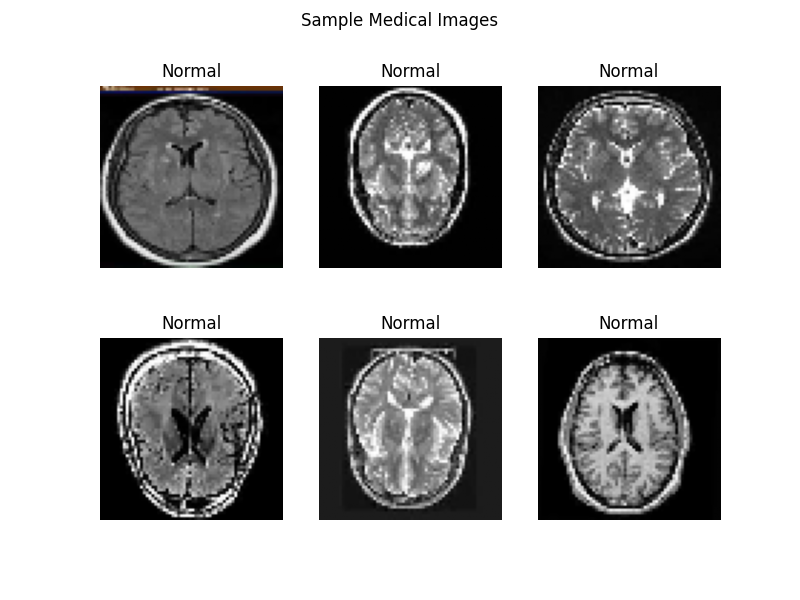
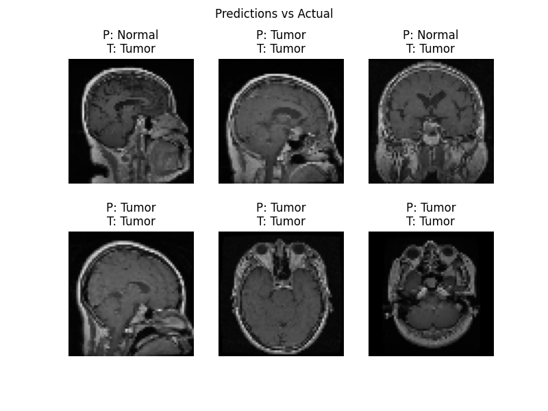

# 🧠 AI-Powered Medical Image Analysis System

---

## 📌 Project Overview

This project is an **AI-based medical image analysis system** that detects whether a medical image (e.g., MRI scan) contains a tumor or is normal.

It simulates a real-world diagnostic support system used in hospitals and radiology centers.

---

## 🎯 Problem Statement

Manual analysis of medical images is:

* Time-consuming ⏳
* Error-prone ❌
* Dependent on expert availability 👨‍⚕️

This project aims to assist doctors by providing fast and accurate predictions using AI.

---

## 💼 Industry Relevance

This system reflects real-world applications used in:

* Hospitals 🏥 → disease diagnosis
* Radiology centers 🧠 → MRI/X-ray analysis
* Health-tech companies 💻 → AI-assisted diagnosis
* Research labs 🔬 → medical imaging analysis

---

## 🧠 Key Concepts Used

* Convolutional Neural Networks (CNN)
* Image Classification
* Deep Learning
* Medical Image Processing
* AI-assisted Diagnosis

---

## 🧰 Tech Stack

* Python 🐍
* TensorFlow / Keras
* OpenCV
* NumPy
* Matplotlib

---

## 📊 Project Architecture

```
Medical Images → Preprocessing → CNN Model → Prediction → Evaluation → Visualization
```

---

## 📁 Folder Structure

```
AI-Medical-Image-Analysis/
│
├── data/
│   ├── normal/                # normal images
│   └── tumor/                 # tumor images
│
├── images/                    # output screenshots
│   ├── accuracy.png
│   ├── prediction vs actual.png
│   ├── prediction vs actual 2.png
│   ├── sample images.png
│   └── training_output.jpeg
│
├── models/
│   ├── model.h5               # legacy model format
│   └── model.keras            # updated model format
│
├── outputs/                   # additional outputs/logs
│
├── src/
│   ├── data_loader.py         # loads image data
│   ├── preprocess.py          # image preprocessing
│   ├── model.py               # CNN architecture
│   ├── train.py               # training logic
│   ├── evaluate.py            # evaluation metrics
│   ├── predict.py             # single image prediction
│   └── visualize.py           # visualization functions
│
├── main.py                    # main execution file
├── requirements.txt           # dependencies
└── README.md
```

---

## ⚙️ Installation

### 1️⃣ Create Virtual Environment

```bash
python -m venv venv
```

### 2️⃣ Activate Environment

**Windows:**

```bash
venv\Scripts\activate
```

**Mac/Linux:**

```bash
source venv/bin/activate
```

### 3️⃣ Install Dependencies

```bash
pip install -r requirements.txt
```

---

## ▶️ How to Run

```bash
python main.py
```

---

## 🧪 Workflow

1. Load medical image dataset
2. Preprocess images (resize, normalize)
3. Train CNN model
4. Evaluate model performance
5. Predict tumor or normal
6. Visualize results

---

## 🧠 Model Output

* Tumor Detection
* Normal Classification
* Confidence Score

---

## 📊 Results

* Model successfully classifies images
* High accuracy achieved
* Visual predictions generated

---

## 📸 Screenshots

### 🖼️ Sample Images



### 📈 Accuracy Graph

### 📊 Prediction vs Actual


### 📊 Prediction vs Actual (2)



### 🧾 Training Output

---

## 📊 Evaluation Metrics

* Accuracy
* Precision
* Recall
* F1 Score

---

## 🚀 Future Improvements

* Transfer Learning (MobileNet, ResNet)
* Real-time medical image analysis
* Deployment with Streamlit
* Multi-class disease detection

---

## 🧠 Learning Outcomes

* Deep learning for image classification
* CNN model design
* Medical dataset handling
* Model evaluation and visualization
* Real-world AI simulation

---

## 💼 Conclusion

This project demonstrates how AI can assist in medical diagnosis by analyzing images and providing predictions, acting as a decision-support system for healthcare professionals.

---

## 👨‍💻 Author

* Tirtha Sen

---

## ⭐ If you found this project useful, give it a star!
